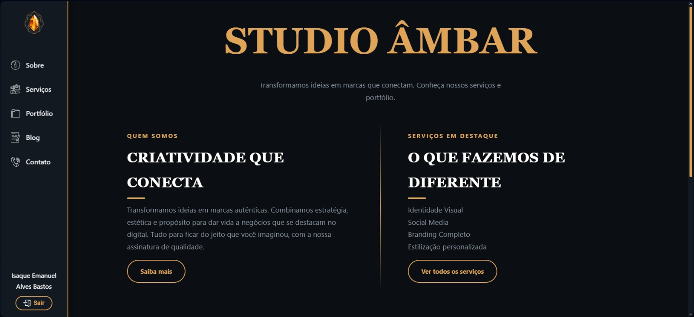
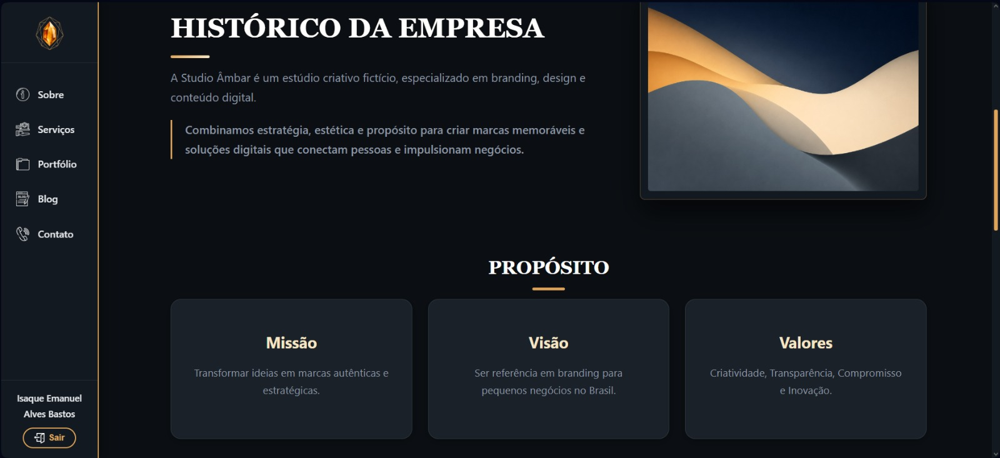
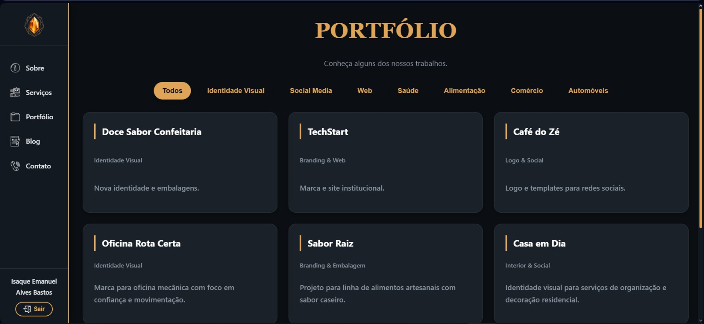
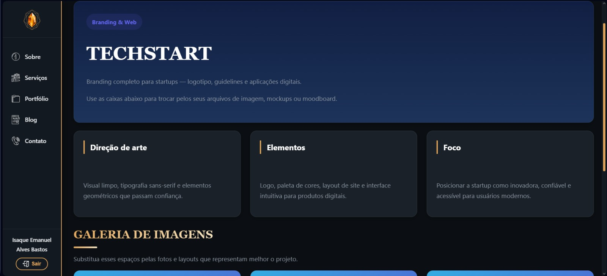

# Studio Âmbar

A Studio Âmbar é uma empresa especializada em identidade visual, criação de marcas, design para redes sociais e soluções digitais para pequenos negócios. A empresa busca transformar ideias em marcas fortes, com comunicação visual profissional e presença digital organizada.

Nosso trabalho atual é a criação das paginas requisitas (um total de 8: Home, Sobre, Serviços, Portfolio, Cases (que juntamos com o proprio Portfolio com PorfolioCase.jsx) Blog e o Contato) 

## Sobre a empresa
A empresa Studio Âmbar atua no ramo de Design Digital, oferecendo Suporte na criação de identidade visual no mercado além de soluções para seus clientes.

## Objetivo do sistema
O sistema tem como objetivo criar toda a estrutura para a empresa ter o funcionamento. Ele permitirá que os usuários possam ver tudo sobre o site, junto com seus serviços / projetos, também permitindo que entrem em contato e assim tendo potenciais clientes.

## Integrantes (e Git)
- Isaque E. A. Bastos (IsaqueA-B)
- Emanuel A. S. Hubner (emanohubner-ui)
- Cássio R. Shultz (quagmire77)
- Leonardo A. Hemmilla (leeoo999)
- Guilherme Z. Thomas (guilhermethomas14-a11y)

## Tecnologias utilizadas
- React
- Vite
- Node.js
- Express
- MySQL
- mysql2
- GitHub

## Como instalar e executar
Clone o repositório:
git clone [LINK_DO_REPOSITORIO](https://github.com/IsaqueA-B/Studio-Ambar.git)

Acesse a pasta do projeto:
cd [Nome-Da-Pasta] (Studio-Ambar)

Instale as dependências:
npm install

Execute o projeto:
npm run dev

Backend (Ainda em desenvolvimento):
cd backend
npm install
npm start

## Variáveis de ambiente
Crie um arquivo .env com base no .env.example.

Exemplo de .env.example:
DB_HOST=
DB_PORT=
DB_NAME=
DB_USER=
DB_PASSWORD=

## Entidades principais
- Clientes: Dados de contato e identificação de clientes/empresas.
- Serviços: Catálogo de serviços com preço e prazo.
- Projetos: Vincula um cliente a um serviço, com data de início e fim.
- Portfólio: Projetos finalizados expostos para o público.
- Contatos: Mensagens enviadas por potenciais clientes.
- Usuários: Contas com níveis de acesso para gerenciar o sistema.

## Endpoints planejados

# Clientes (/clientes)
- GET /clientes → Lista todos.
- POST /clientes → Cadastra um novo.
- PUT /clientes/:id → Atualiza dados.
- DELETE /clientes/:id → Remove do sistema.

# Serviços (/servicos)
- GET /servicos → Lista os serviços.
- POST /servicos → Cria novo serviço.
- PUT /servicos/:id → Edita preço/prazo.
- DELETE /servicos/:id → Deleta o serviço.

# Projetos e Portfólio
- GET /projetos → Lista projetos ativos.
- POST /projetos → Cria um novo projeto.
- GET /portfolio → Lista itens públicos do portfólio.

## Prints do projeto

## Status do projeto
Toda a base ja esta bem estruturada, com o sistema de navegação correta, paginas criadas e varias funções ja atribuidas, agora precisamos adicionar os ultimos detalhes (como a anexação do banco de dados) e personalizar ainda mais o site deixando realmente profissional e estilizado.

Todas as paginas ja tem toda a gama de informação necessaria, apenas vamos organizar melhor daqui para a frente dando mais identidade visual para o Studio Âmbar.
